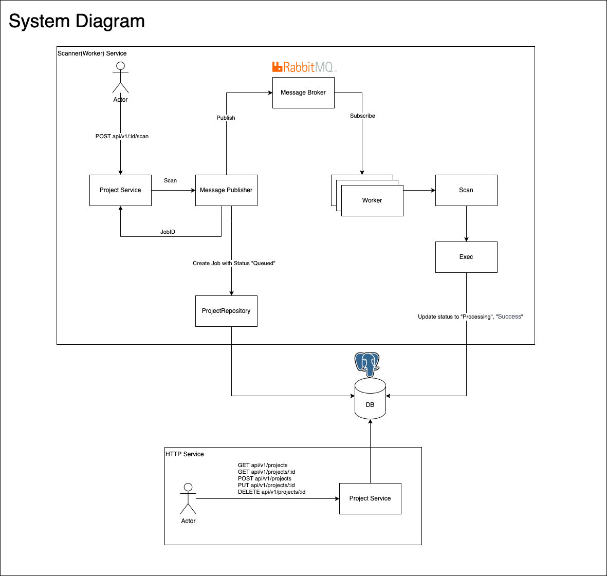

# Linear Avocado

Inspiration from  onion architecture (Clean architecture) as
avocado ! .

## ⚠️ In progress ⚠️

This project still work in progress.

## Features
- [X] Containerized
- [X] CRUD project API
- [X] Scanning project
- [X] Business logic testing
- [X] Job detail API
- [X] API Document (swagger)

## Start Project in local

```shell
cp env.eample .env
docker-compose up -d
```

## Development

```shell
cp env.eample .env

go run cmd/httpserv/main.go
go run cmd/worker/main.go

# or using air (https://github.com/cosmtrek/air) for hot reload
air -c .air.http.toml
air -c .air.worker.toml
```

## API Document
```shell
# replace host name and port
http://localhost:8080/swagger/index.html#/
```

## Project structure

### /internal

Contain business logic may use for solve functional requirement.

- project – Project management
- scanner – To tracking any job from scan project request.
- pkg – Share package use for reduce duplicate code

```
.
└── internal
    └── project
        ├── adapter         // implemetation of ports
        ├── ports           // interface for depencies, like http, repository, cache
        ├── entity          // business data object
        ├── mocks           // mock struct generated from 
        ├── models          // struct use for represent data from database
        ├── usecase         // busines logic
        └── project.go      // dependencies injection function

```

### /pkg

Contain utilities function for non-functional requirement like database, message broker, other technical function.

- scanner – global scanner interface including models rule, finding


### /cmd

Like a command use for combined source code to cli.

- httpserv – HTTP service use for handle request from http
- worker – Scanner service using **AMPQ** for subscribe topic "scan-project" from message broker

### /tests

Integration test saved here example, .http, api testing, postman, etc. 

## System design

An overall system design, which components are
- HTTP service (Golang, amqp, gin, bun)
- Worker service (Golang, amqp, bun)
- Database (Postgres)
- Message Broker (RabbitMQ)



## Improvement

- Separate project to distribution repository
- Add more API test to coverage handler, repository function
- Add more unittest for business logic
- Friendly error handling
