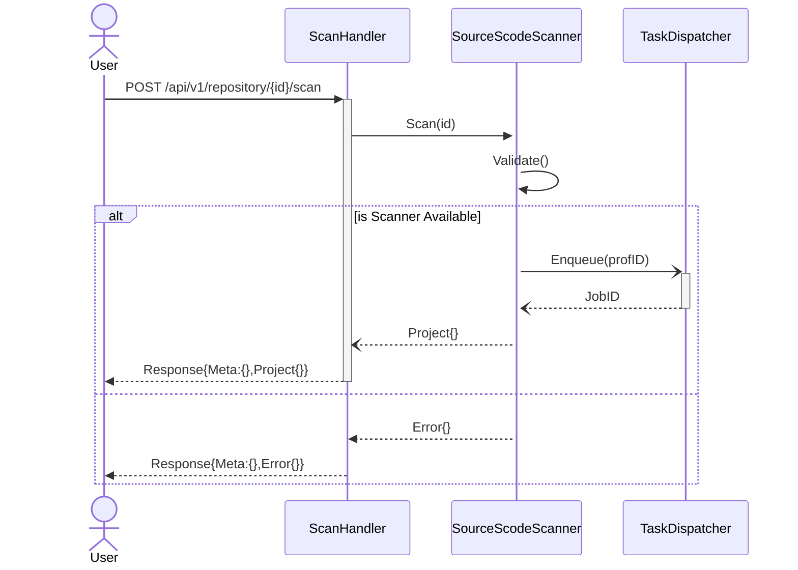
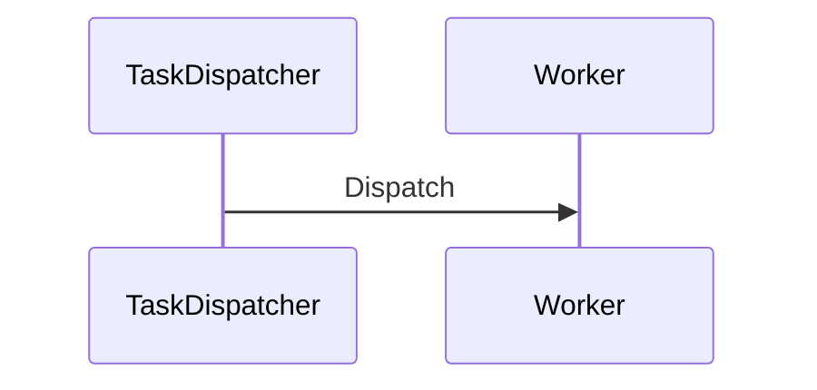

## Scanning Request

```mermaid
sequenceDiagram
    actor User
    
    User->>+ScanHandler: POST /api/v1/repository/{id}/scan
    ScanHandler->>+SourceScodeScanner: Scan(id)
    SourceScodeScanner->>SourceScodeScanner: Validate()
    alt is Scanner Available 
        SourceScodeScanner-)+TaskDispatcher: Enqueue(profID)
        TaskDispatcher--)-SourceScodeScanner: JobID
        SourceScodeScanner--)ScanHandler: Project{}
        ScanHandler-->>-User: Response{Meta:{},Project{}}
    else
        SourceScodeScanner-->>ScanHandler: Error{}
        ScanHandler-->>User: Response{Meta:{},Error{}}
    end
    
```

## Project Scanning

```mermaid
sequenceDiagram
    
    TaskDispatcher->>Worker: Dispatch
    
```